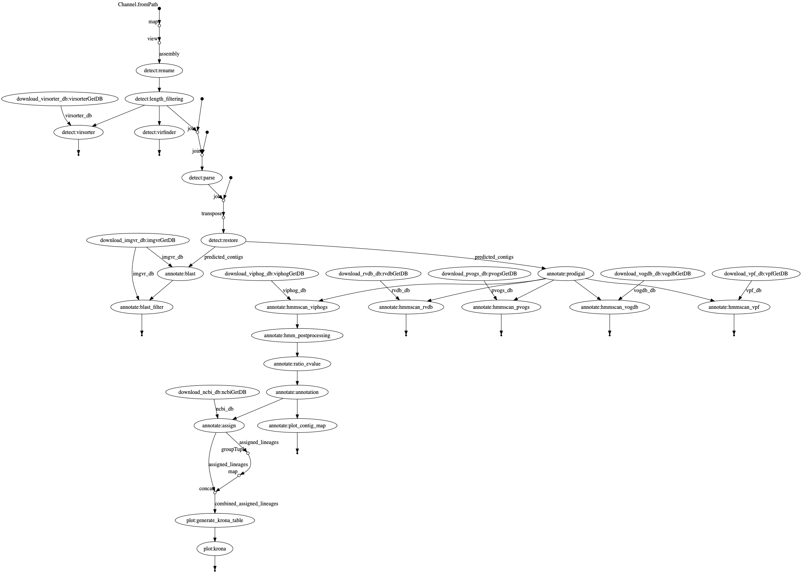

Email: hoelzer.martin@gmail.com

__2020-05-04: This repository is now integrated into the EBI repository of the [VIRify pipeline](https://github.com/EBI-Metagenomics/emg-viral-pipeline) and will not be further maintained in this spot.__

# VIRify


A nextflow implementation of the [EBI VIRify pipeline](https://github.com/EBI-Metagenomics/emg-viral-pipeline) for the detection of viruses from metagenomic assemblies.
This implementation is heavily based on scripts and work by [Guillermo Rangel-Pineros](https://github.com/guille0387) and the [EBI Sequence Families Team](https://www.ebi.ac.uk/about/people/rob-finn).

## What do I need?

This pipeline runs with the workflow manager [Nextflow](https://www.nextflow.io/) using [Docker](https://docs.docker.com/v17.09/engine/installation/linux/docker-ce/ubuntu/#install-docker-ce) (Conda will be implemented soonish, hopefully). All other programs and databases are automatically downloaded by Nextflow. _Attention_, the workflow will download databases with a size of roughly 27 GB the first time it is executed. 

### Install Nextflow
```bash
curl -s https://get.nextflow.io | bash
```
* see [more instructions about Nextflow](https://www.nextflow.io/). 

### Install Docker
If you dont have experience with bioinformatic tools and their installation just copy the commands into your terminal to set everything up:
```bash
sudo apt-get install -y docker-ce docker-ce-cli containerd.io
sudo usermod -a -G docker $USER
```
* restart your computer
* see [more instructions about Docker](https://docs.docker.com/v17.09/engine/installation/linux/docker-ce/ubuntu/#install-docker-ce)


## Basic execution

Simply clone this repository or get or update the workflow via Nextflow:
```bash
nextflow pull hoelzer/virify
```

Get help:
```bash
nextflow run hoelzer/virify --help
```

Run annotation for a small assembly file (takes approximately 30min + time for database download; ~27 GB):
````
nextflow run hoelzer/virify --fasta '~/.nextflow/assets/hoelzer/virify/example_data/assembly.fasta'
````

## Profiles

Per default the workflow is run with Docker-support. When you execute the workflow on a HPC you can switch to 
* SLURM (``-profile slurm``)
* LSF (``-profile lsf``)
and then you should also define the parameters
* --workdir (here your work directories will be save)
* --databases (here your databases will be saved and the workflow checks if they are already available)
* --cachedir (here Docker/Singularity containers will be cached)

The ``-profile conda`` is not working at the moment. Sorry. Use Docker. Please. 

## DAG chart



